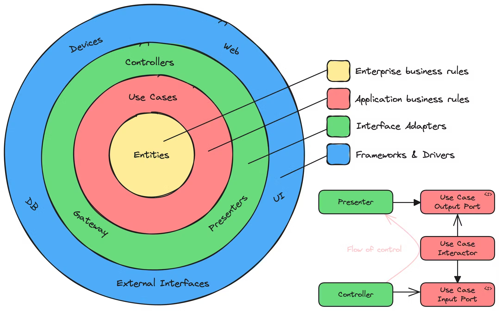

<p align="center">
  <a href="http://nestjs.com/" target="blank"></a>
</p>

[circleci-image]: https://img.shields.io/circleci/build/github/nestjs/nest/master?token=abc123def456
[circleci-url]: https://circleci.com/gh/nestjs/nest

  <p align="center">A progressive <a href="http://nodejs.org" target="_blank">Node.js</a> framework for building efficient and scalable server-side applications.</p>
    <p align="center">
<a href="https://www.npmjs.com/~nestjscore" target="_blank"></a>
<a href="https://www.npmjs.com/~nestjscore" target="_blank"></a>
<a href="https://www.npmjs.com/~nestjscore" target="_blank"></a>
<a href="https://circleci.com/gh/nestjs/nest" target="_blank"></a>
<a href="https://coveralls.io/github/nestjs/nest?branch=master" target="_blank"></a>
<a href="https://discord.gg/G7Qnnhy" target="_blank"></a>
<a href="https://opencollective.com/nest#backer" target="_blank"></a>
<a href="https://opencollective.com/nest#sponsor" target="_blank"></a>
  <a href="https://paypal.me/kamilmysliwiec" target="_blank"></a>
    <a href="https://opencollective.com/nest#sponsor"  target="_blank"></a>
  <a href="https://twitter.com/nestframework" target="_blank"></a>
</p>
  <!--[](https://opencollective.com/nest#backer)
  [](https://opencollective.com/nest#sponsor)-->

# Nerdery - NestJs challenge

# Setup in development enviroment

Make sure to have docker and node installed.

1. Clone the project

```
git clone https://github.com/jffc-dev/GamingStore.git
```

2. Fetch dependencies

```
cd GamingStore
npm install
```

3. Create an .env file in the root of the project to configure the necessary environment variables. You can use the .env.example file as a reference. Make sure to change the values to match your database, JWT, and other services configurations.

```
cp .env.example .env
```

4. Set Up PostgreSQL with Docker
```
docker-compose up -d
```

5. Run Prisma Migrations. Once the PostgreSQL container is running, run the Prisma migrations to create the tables in the database:

```
npx prisma migrate dev
```

6. If you want seed data, you can use:

```
npm run seed
```

# Introduction:

This application is based on Clean Architecture, a software design philosophy that aims to separate concerns and ensure the maintainability and scalability of an application. By following Clean Architecture principles, we organize the code in a way that keeps the core business logic independent of external frameworks, databases, and user interfaces.



In this application, we used NestJS, which provides a robust foundation for building scalable and maintainable applications, while adhering to the principles of Clean Architecture. This helps us achieve a well-structured codebase, where the core logic (domain layer) is decoupled from the outer layers (like database access, APIs, etc.).

Why Use Clean Architecture:
- Separation of Concerns: Clean Architecture divides the application into layers, where each layer has a specific responsibility. This separation makes it easier to manage the code and prevents dependencies from reaching the core logic.
- Testability: With a clear separation between business logic and external systems, testing becomes more straightforward. The core logic can be unit tested independently of the database, APIs, or other external systems.
- Maintainability: As the application grows, the codebase remains organized, and modifications in one part of the system do not affect other parts. This reduces the risk of introducing bugs when implementing new features or making changes.
- Scalability: Clean Architecture supports scaling the application easily. You can add new features, like integrating with third-party services or databases, without impacting the core functionality.
By applying these principles to this app, we ensure that it remains flexible, maintainable, and easily extendable in the long run, while leveraging the power of NestJS to handle the application logic efficiently.


# Requirements:

```jsx
# Homework

### Build your tiny API store.
You can choose the target of your business, be creative!.
**Examples:** snack store, pet store, drug store.

## Technical Requirements
* PostgreSql
	** Kysely / Drizzle
	** Prisma
* NestJS
* Typescript
* Prettier
* Eslint

## Mandatory Features
1. Authentication endpoints (sign up, sign in, sign out, forgot, reset password)
2. List products with pagination
3. Search products by category
4. Add 2 kinds of users (Manager, Client)
5. As a Manager I can:
    * Create products
    * Update products
    * Delete products
    * Disable products
    * Show clients orders
    * Upload images per product.
6. As a Client I can:
    * See products 
    * See the product details
    * Buy products
    * Add products to cart
    * Like products
    * Show my order
7. The product information(included the images) should be visible for logged and not logged users
8. Stripe Integration for payment (including webhooks management) 

## Mandatory Implementations
Schema validation for environment variables
Usage of global exception filter
Usage of guards, pipes (validation)
Usage of custom decorators
Configure helmet, cors, rate limit (this last one for reset password feature)

## Extra points
* Implement resolve field in graphQL queries (if apply)
* When the stock of a product reaches 3, notify the last user that liked it and not purchased the product yet with an email. 
  Use a background job and make sure to include the products image in the email.
* Send an email when the user changes the password
* Deploy on Heroku

## Notes: 

Requirements to use Rest: 
* Authentication endpoints (sign up, sign in, sign out, forgot, reset password)
* Stripe Integration for payment (including webhooks management)

Requirements to use Graph: 
* The ones not included in the block above

```

# GamingStore - E-Commerce Platform

**GamingStore** is a modern e-commerce platform designed to provide a seamless online shopping experience for electronics enthusiasts. Whether you're looking for the latest laptops, high-performance computers, cutting-edge monitors, or other electronic accessories, our store has you covered.

## Tech Stack

This project leverages modern technologies for both frontend and backend development:  
- **Backend**: [NestJS](https://nestjs.com/), [Prisma](https://www.prisma.io/), [PostgreSQL](https://www.postgresql.org/)  
- **Authentication**: JSON Web Tokens (JWT)  
- **Deployment**: Docker, AWS, or similar  

## Progress

This section tracks the progress of the project by listing completed and pending tasks for each development branch.

## Main Branches and Tasks

### `main`
- [x] Initialize project with `NestJS`.  
- [x] Deploy initial version to production. 

---

### `feature/environment`
- [x] Configure environment variables using `.env` files.  
- [x] Integrate Prisma for database ORM.  
- [x] Set up Docker for development and production environments.  
- [x] Create documentation for setting up local environments.  
- [x] Add validation for environment variables.  

---

### `feature/database-design`
- [X] Define initial database schema using Prisma.    
- [X] Implement migrations to sync schema with the database.    
- [X] Document schema relationships and data flow for developers.  
- [X] Test database queries using Prisma Client.   

---

### `feature/register-user`
- [X] **Implement business logic for user creation**
  - [X] Add a service function to:
    - Validate input data (`name`, `email`, `password`).
    - Hash the password using `bcrypt`.
    - Save the user to the database.
  - [X] Handle common errors:
    - Duplicate email.
    - Invalid input.

- [X] **Implement the `POST /auth/register` endpoint**
  - [X] Add the route for user creation.
  - [X] Create a controller to:
    - Validate incoming requests using a schema (e.g., Joi or Zod).
    - Call the service to create the user.
    - Return appropriate responses (e.g., `201 Created`, `400 Bad Request`, `409 Conflict`).
  - [X] Ensure the password is not exposed in the response.

- [X] **Validate input data**
  - [X] Define validation rules for:
    - `name`: Required, non-empty string.
    - `email`: Required, valid email format, unique.
    - `password`: Required, at least 8 characters.

---

### `feature/login-user`
- [x] **Implement the `POST /auth/login` endpoint**
  - [x] Create the route for user login.
  - [x] Create a controller to:
    - Validate incoming requests with a schema (e.g., email and password are required).
    - Call the authentication service.
    - Return appropriate responses (`200 OK` on success, `401 Unauthorized` for invalid credentials).

- [x] **Add authentication service**
  - [x] Create a function to handle authentication:
    - Validate the user's email and password.
    - Retrieve the user from the database by email.
    - Compare the provided password with the stored hashed password using `bcrypt`.
    - Generate a JSON Web Token (JWT) for successful authentication.
  - [x] Handle errors:
    - User not found.
    - Password does not match.

- [x] **Define login input validation**
  - [x] Add validation rules for:
    - `email`: Required, valid email format.
    - `password`: Required, non-empty string.

---

### `feature/sign-out`
- [x] **Implement the `POST /auth/logout` endpoint**
  - [x] Create the route for user logout.
  - [x] Add a controller to:
    - Return a `200 OK` response.
  - [x] If using JWT:
    - Implement token invalidation by:
      - Storing blacklisted tokens in a database or in-memory cache.
      - Returning a success response after invalidation.

---

### `feature/forgot-password`
- [x] **Implement the `POST /auth/forgot-password` endpoint**
  - [x] Create the route for initiating the password reset process.
  - [x] Add a controller to:
    - Validate the provided email.
    - Look up the user by email in the database.
    - Generate a secure reset token (e.g., UUID or a random string).
    - Store the reset token and its expiration (e.g., `reset_password_token` and `reset_password_expires_at`) in the database.
    - Send an email with the reset token and instructions for resetting the password.

- [x] **Set up secure token generation**
  - [x] Use a library like `crypto` or `uuid` to generate unique, secure tokens.
  - [x] Configure the expiration time for reset tokens (e.g., 15 minutes or 1 hour).

- [x] **Send the reset email**
  - [x] Integrate an email service (e.g., SendGrid, Nodemailer) to send the reset link.
  - [x] Include the token and instructions in the email, such as:
    ```
    Click the link below to reset your password:
    https://app.com/reset-password?token=<RESET_TOKEN>
    ```

---

### `feature/reset-password`
- [x] **Implement the `POST /reset-password` endpoint**
  - [x] Create the route for resetting the password.
  - [x] Add a controller to:
    - Validate the reset token and check its expiration.
    - Look up the user by the token in the database.
    - Validate the new password (e.g., minimum length, complexity).
    - Hash the new password using `bcrypt`.
    - Update the user's password in the database.
    - Clear the reset token and expiration fields from the database.

- [x] **Add validation for input data**
  - [x] Ensure the `reset_token` is valid and not expired.
  - [x] Validate the new password against security requirements (e.g., at least 8 characters).

- [x] **Secure the password reset process**
  - [x] Use a strong hashing algorithm like `bcrypt` to hash the new password.
  - [x] Immediately invalidate the reset token after use to prevent reuse.

---

### `feature/product-crud`

- [x] **Get All Products**
  - [x] Define a `products` query in the GraphQL schema.
  - [x] Implement a resolver to fetch and return all products.
  - [x] Add a service method to retrieve the product list from the database.

- [x] **Get Product by ID**
  - [x] Define a `product(id: ID!)` query in the GraphQL schema.
  - [x] Implement a resolver to fetch and return a product by its ID.
  - [x] Add a service method to find the product in the database.

- [x] **Create Product**
  - [x] Define a `createProduct(input: CreateProductInput!)` mutation in the schema.
  - [x] Implement a resolver to handle the mutation.
  - [x] Add a service method to insert the product into the database.
  - [x] Validate inputs (e.g., name, price > 0, stock ≥ 0).

- [x] **Update Product**
  - [x] Define an `updateProduct(id: ID!, input: UpdateProductInput!)` mutation in the schema.
  - [x] Implement a resolver to handle the mutation.
  - [x] Add a service method to update the product in the database.
  - [x] Validate inputs (e.g., price > 0, stock ≥ 0).

- [x] **Delete Product**
  - [x] Define a `deleteProduct(id: ID!)` mutation in the schema.
  - [x] Implement a resolver to handle the mutation.
  - [x] Add a service method to delete the product from the database.

---


### `feature/add-to-cart`
- [x] **Implement the `addToCart` mutation**
  - [x] Define the GraphQL schema:
    - Add a `mutation addToCart(userId: ID!, productId: ID!, quantity: Int!): CartDetail`.
  - [x] Create a resolver for:
    - Validating the input (product ID and quantity).
    - Returning the updated cart detail.
    - Returning appropriate error responses for invalid input or product not found.
  - [x] Add service logic to:
    - Check if the product exists.
    - Verify stock availability.
    - Add or update the product quantity in the cart.
  - [x] Update the `CartDetail` model:
    - Create or update entries for `userId`, `productId`, and `quantity`.
- [x] **Add validations and edge cases**
  - [x] Ensure product stock is sufficient for the requested quantity.
  - [x] Handle cases where the user or product does not exist.
  - [x] Prevent negative or zero quantities from being added.

---

### `feature/product-images`  
- [X] Ensure product information (including images) is accessible to both logged and not logged users.  
- [X] Update the `ProductResolver` to include logic for public and authenticated queries.  
- [X] Validate that images are properly served and permissions do not restrict visibility.  
- [X] Test product queries for both authenticated and unauthenticated users.

---

### `feature/disable-products`  
- [X] Add a feature to allow managers to disable products.  
- [X] Update the product entity to include an `isActive` flag for toggling visibility.  
- [X] Implement a mutation in the `ProductResolver` to handle product disabling.  
- [X] Ensure disabled products are excluded from public queries.  
- [X] Test the disable functionality and its impact on product visibility for users.

---

### `feature/manage-orders`  

#### **Order Creation**  
- [x] Add a feature to allow users to create orders from their shopping cart.  
- [x] Update the `Order` entity to include necessary fields (e.g., `orderId`, `userId`, `items`, `totalPrice`, `status`, `createdAt`).  
- [x] Implement a mutation in the `OrderResolver` to handle order creation.  
- [x] Create an `OrderItem` entity to represent individual items in an order, linked to products.  
- [x] Validate that the shopping cart items and their quantities are available before creating the order.  
- [x] Deduct stock quantities for purchased products upon successful order creation.  
- [x] Notify users of order confirmation and provide an order summary.  
- [x] Ensure proper error handling for cases like insufficient stock or invalid cart.  
- [x] Write unit tests for the order creation functionality.  

#### **Retrieve Orders**  
- [x] Implement a query in the `OrderResolver` to allow users to retrieve their orders.  
  - Fields: `orderId`, `items`, `totalPrice`, `status`, `createdAt`.  
- [x] Allow filtering options for retrieving orders (e.g., by `status` or `date range`).  
- [x] Ensure orders are only accessible to the respective user.  
- [x] Write tests to validate order retrieval and authorization.

#### **Admin/Manager Order Queries**  
- [x] Implement a query in the `OrderResolver` to allow admins or managers to retrieve orders by user.  
  - Fields: `orderId`, `userId`, `items`, `totalPrice`, `status`, `createdAt`.  
- [x] Add support for pagination and sorting options for better manageability.  
- [x] Ensure proper role-based access control for this feature.  
- [x] Write tests to validate the retrieval of orders by user and access restrictions.

---

### `feature/stripe-integration`

#### **Stripe Webhook Controller**
- [x] Create a `WebhookController` in NestJS to handle incoming webhook requests.
  - [x] Define a `@Post()` route for the `/webhook` endpoint.
  - [x] Use `express.raw` middleware to parse incoming requests as raw data for Stripe signature verification.
- [x] Implement event handlers for:
  - `payment_intent.succeeded`: Update order status to "Paid" and notify the user.
  - `payment_method.attached`: Update the user record with the new payment method.
  - (Add additional handlers as needed for other subscribed events.)
- [x] Log unhandled event types for debugging purposes.

---

**Note**: Tasks marked as `[x]` are completed. Use `[ ]` for pending tasks and update this list as you progress.  

